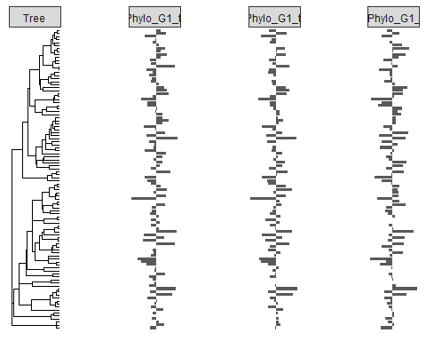
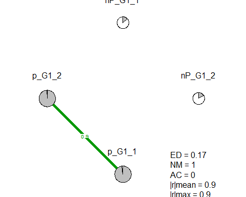

<!-- README.md is generated from README.Rmd. Please edit that file -->

# TrEvol

<!-- badges: start -->
<!-- badges: end -->

The goal of TrEvol is to provide easy to use functions to study
functional trait syndromes evolutionary patterns. More concretly, this
package is focused on separating trait variance and the covariance
(represented as correlation) among pairs of traits into a phylogenetic
and a non-phylogenetic component. This allows to quantify the amount of
phylogenetic conservatism (phylogenetic signal) and evolutionary
lability in traits and their correlation.

Moreover, the package allows to consider one environmental variable when
doing that, which allows to further separate trait variances and
correlation among pairs of traits into four components, quantifying its
relationship with the phylogeny and an environmental variable of
interest. The first component is the *non-attributed phylogenetic
variances and correlation*, and represents the variance and correlation
that is related only to the phylogeny (not related to the environmental
variable). The second component is the *environmental phylogenetic
variances and correlation*, representing the variances and correlation
related both to the phylogeny and an environmental variable. The third
component is the *labile environmental variances and correlation*, and
represents the amount of variance and correlation that is only related
to the environmental variable (not related to the phylogeny). Finally,
the fourth component is the *residual variances and correlation*, which
is not related to the phylogeny nor to an environmental variable of
interest. Total correlation among traits is also calculated.

The package allows then to characterize variance and covariance patterns
for a group of traits. To represent these results, the package use trait
networks, showing the variance components in the nodes and the
correlation among traits as edges. The package allows to display network
metrics describing the structure of the network. Networks can be
represented for each of the variance and covariance components
previously described, and they can be compared.

The package also includes an imputation framework which uses random
forest to predict missing values including phylogenetic and
environmental information as well as the relationship between traits.
This imputation framework optimizes the use of the information by
selecting the elements that are expected to be bette predictors and uses
them to impute missing values in a given dataset.

## Installation

You can install the development version of TrEvol from
[GitHub](https://github.com/) with:

``` r
# install.packages("devtools")
devtools::install_github("pablosanchezmart/TrEvol")
```

## Simulate example data

This is a basic example showing how to use the package using simulated
data. First of all, let’s simulate some data to work with. To do so, we
will use the **simulateDataSet** function from the package using the
default parameters.

``` r
library(TrEvol)
```

``` r
simulated.data <- simulateDataSet(number_observations = 100)
```

The **simulateDataSet** function simulates a set of correlated variables
and a phylogeny. The variance-covariance matrix used to simulate traits
variances (diagonal) and correlations (off-diagonal) is reported by the
function and can be modified using the *vcv_matrix* argument.

``` r
simulated.data$vcv_matrix
#>           G1_trait1 G1_trait2 G1_env G2_trait1 G2_trait2 G2_env
#> G1_trait1       1.0       0.9    0.8       0.0       0.1    0.2
#> G1_trait2       0.9       1.0    0.8       0.0       0.1    0.2
#> G1_env          0.8       0.8    1.0       0.0       0.1    0.2
#> G2_trait1       0.0       0.0    0.0       1.0       0.9    0.8
#> G2_trait2       0.1       0.1    0.1       0.9       1.0    0.8
#> G2_env          0.2       0.2    0.2       0.8       0.8    1.0
```

The **simulateDataSet** function produces two sets of variables. The
firs set uses the variance-covariance matrix to simulate
phylogenetically structured data under a Brownian motion model of
evolution. These variables are preceded by “phylo\_”. To do so, the
function simulates a phylogeny with the same number of tips as number of
observations to be simulated (set in the number_observations argument).
A phylogeny can be introduced manually using the *phylogeny* argument.
The second set of variables are simulated in a non-phylogenetically
structured manner. So their variances and covariances will not present a
phylogenetic component. These variables are preceded by “nonPhylo\_”.
Each of the sets have 6 variables, 4 will be considered traits and one
will be considered as an enviornmental variable. Names of each variable
show the expected correlation group (G1 or G2, for each set of traits).
So we expect phylo G1 to be correlated among them and to present
variances and covariances related to the phylogeny and to the
phylo_G1_env environmental variable.

``` r
head(simulated.data$data)
#>   animal phylo_G1_trait1 phylo_G1_trait2 phylo_G1_env phylo_G2_trait1
#> 1     t1        1.072116      -0.9752384     1.656133       -2.242879
#> 2    t10       -4.735183      -4.9128796    -3.243088       -1.119801
#> 3   t100        2.294436       2.0289785     2.465409        4.572772
#> 4    t11        1.954700       1.8197485     3.974610       -2.453682
#> 5    t12        6.402125       5.9022611     6.248121       -2.898684
#> 6    t13       -5.423374      -5.0502514    -3.706590        1.375911
#>   phylo_G2_trait2 phylo_G2_env nonPhylo_G1_trait1 nonPhylo_G1_trait2
#> 1      -0.4388276   -1.1931079          1.0118911          1.5462057
#> 2      -1.3092094   -2.3670976          0.3126132         -0.1287018
#> 3       5.4179679    2.2090773         -0.6895039         -0.9766765
#> 4      -2.3942920    0.2512342          0.3566807         -0.7794363
#> 5      -2.3465475   -0.1155738          1.3066856          1.2733522
#> 6       1.8505027    0.3811022          0.5798681          0.6448126
#>   nonPhylo_G1_env nonPhylo_G2_trait1 nonPhylo_G2_trait2 nonPhylo_G2_env
#> 1        1.442753          1.1748964          1.4513738      0.05899254
#> 2       -1.232994          0.1877420          0.3535167      0.17674533
#> 3       -1.160640         -2.1270824         -1.6736781     -1.86152450
#> 4       -0.166116         -0.7133343         -0.1903321     -0.80364117
#> 5        1.156282         -0.3056505          0.6316942     -0.77899084
#> 6        1.564784          0.9020432          1.0801122      0.43562163
```

We can use the function *plotData* to plot some simulated traits. Let’s
plot the phylo_G1 traits and environmental variable.

``` r
plotData(variables = c("phylo_G1_trait1", "phylo_G1_trait2", "phylo_G1_env"),
         dataset = simulated.data$data,
         phylogeny = simulated.data$phylogeny,
         terminal.taxon = "animal" 
          )
```


In this plot we can se how the simulated variances and covariances are
phylogenetically conserved. Let’s now plot the nonPhylo_G1 traits and
environmental variable.

``` r
plotData(variables = c("nonPhylo_G1_trait1", "nonPhylo_G1_trait2", "nonPhylo_G1_env"),
         dataset = simulated.data$data,
         phylogeny = simulated.data$phylogeny,
         terminal.taxon = "animal" 
          )
```

 We
see how these variables variances and covariances are not
phylogenetically conserved.

## Compute variances and covariances for simulated data

Now we can use the function **computeVarianceCovariancePartition** to
report the correlation structure between traits.

Let’s imagine that we are only interested in computing the phylogenetic
and non-phylogenetic variances and covariances. So, for now, let’s nos
include an environmental variable in the function. In this case,
phylogenetic variances and correlation and non-phylogenetic variances
and correlation will be reported, jointly with total correlation. We
will use the default model specifications, but users can modify this by
using the defineModelsSpecifications function to create an object that
then can be introduced in the *model_specifications* argument of the
**computeVarianceCovariancePartition** function. This will be specially
needed with complex data, where number of iterations, burning and
thinning will need to be increased. Users can also explore using
different priors.

``` r
variance_covariance_results.list <- computeVarianceCovariancePartition(
  traits =  c("nonPhylo_G1_trait1", "nonPhylo_G1_trait2", "phylo_G1_trait1", "phylo_G1_trait2"),
  dataset = simulated.data$data,
  terminal_taxa = "animal",
  phylogeny = simulated.data$phylogeny
  )
#> Warning in computeVarianceCovariancePartition(traits = c("nonPhylo_G1_trait1",
#> : Using default model specificatios. Use defineModelsSpecifications() output on
#> model_specifications argument to set them manually.
```

We can now explore the variance-covariance results. First, let’s look at
the variance results.

``` r
variance_covariance_results.list$varianceResults
#>                trait number_observations phylogenetic_variance
#> 1 nonPhylo_G1_trait1                 100             0.2064273
#> 2 nonPhylo_G1_trait2                 100             0.1507537
#> 3    phylo_G1_trait1                 100             0.9848182
#> 4    phylo_G1_trait2                 100             0.9881474
#>   non_phylogenetic_variance p_value_phylogenetic_variance
#> 1               0.793572717                             0
#> 2               0.825438849                             0
#> 3               0.010113404                             0
#> 4              -0.001535053                             0
```

Now, let’s look at the covariance results, which are reported as
correlation.

``` r
variance_covariance_results.list$covarianceResults
#>              trait_1            trait_2 number_observations total_correlation
#> 1 nonPhylo_G1_trait1 nonPhylo_G1_trait2                 100        0.85200425
#> 2 nonPhylo_G1_trait1    phylo_G1_trait1                 100        0.17215789
#> 3 nonPhylo_G1_trait1    phylo_G1_trait2                 100        0.12692290
#> 4 nonPhylo_G1_trait2    phylo_G1_trait1                 100        0.13045828
#> 5 nonPhylo_G1_trait2    phylo_G1_trait2                 100        0.07393951
#> 6    phylo_G1_trait1    phylo_G1_trait2                 100        0.90370211
#>   phylogenetic_correlation non_phylogenetic_correlation
#> 1               0.10113263                  0.750871622
#> 2               0.16878501                  0.003372881
#> 3               0.13107974                 -0.004156837
#> 4               0.10638169                  0.024076587
#> 5               0.05390709                  0.020032424
#> 6               0.88882470                  0.014877415
#>   p_value_total_correlation p_value_phylogenetic_correlation
#> 1                 0.0000000                       0.00000000
#> 2                 0.0000000                       0.04444444
#> 3                 0.2222222                       0.17777778
#> 4                 0.1333333                       0.31111111
#> 5                 0.4000000                       0.35555556
#> 6                 0.0000000                       0.00000000
#>   p_value_non_phylogenetic_correlation
#> 1                            0.0000000
#> 2                            0.8888889
#> 3                            0.8888889
#> 4                            0.4000000
#> 5                            0.4888889
#> 6                            0.0000000
```

We can now plot this results as trait networks using the
**plotNetworks**. Let’s first plot the phylogenetic part of the variance
and covariance.

``` r
plotNetwork(variance_results = variance_covariance_results.list$varianceResults,
            correlation_results = variance_covariance_results.list$covarianceResults,
            variance_type = "phylogenetic_variance", 
            correlation_type = "phylogenetic_correlation", 
            edge_label = T, 
            only_significant = T, 
            correlation_threshold = 0.3,
            label_size = 1)
#> [1] "Node degree:"
#> nonPhylo_G1_trait1 nonPhylo_G1_trait2    phylo_G1_trait1    phylo_G1_trait2 
#>                  0                  0                  1                  1
```



    #> From     To  Weight
    #> 3     ---     4   0.89

Let’s now plot the non-phylogenetic variances and covariances.

``` r
plotNetwork(variance_results = variance_covariance_results.list$varianceResults,
            correlation_results = variance_covariance_results.list$covarianceResults,
            variance_type = "non_phylogenetic_variance", 
            correlation_type = "non_phylogenetic_correlation", 
            edge_label = T, 
            only_significant = T, 
            correlation_threshold = 0.3)
#> [1] "Node degree:"
#> nonPhylo_G1_trait1 nonPhylo_G1_trait2    phylo_G1_trait1    phylo_G1_trait2 
#>                  1                  1                  0                  0
```


    #> From     To  Weight
    #> 1     ---     2   0.75

We observe how much of the variance and covariance in the phylo_G1
traits is related to the phylogeny, and that the variances and
covariances in nonPhylo_G1 traits are not related to the phylogeny, as
expected.

## Compute variances and covariances for simulated data including an enviornmental variable

Let’s now ilustrate how to include an environmental variable. This will
allow us to calculate four different variance and covariance components:
the *non-attributed phylogenetic variance and covariance*, the
*phylogenetic environmental variance and covariance*, the *labile
environmental variance and covariance* and the *residual variance and
covariance*. Let’s use the phylo_G1_env variable as an enviornmental
variable, which is expected to be related to variances and covariances
of phylo_G1 traits in a phylogenetically conserved manner (i.e.,
phylogenetic environmental variance and covariance).

``` r
variance_covariance_environment_results.list <- computeVarianceCovariancePartition(
  traits =  c("nonPhylo_G1_trait1", "nonPhylo_G1_trait2", "phylo_G1_trait1", "phylo_G1_trait2"),
  environmental_variable = "phylo_G1_env",
  dataset = simulated.data$data,
  terminal_taxa = "animal",
  phylogeny = simulated.data$phylogeny
  )
#> Warning in computeVarianceCovariancePartition(traits = c("nonPhylo_G1_trait1",
#> : Using default model specificatios. Use defineModelsSpecifications() output on
#> model_specifications argument to set them manually.
```

We can see now these components in both variance and covariance results.

``` r
variance_covariance_environment_results.list$varianceResults
#>                trait number_observations phylogenetic_variance
#> 1 nonPhylo_G1_trait1                 100             0.5263173
#> 2 nonPhylo_G1_trait2                 100             0.2752204
#> 3    phylo_G1_trait1                 100             0.9846289
#> 4    phylo_G1_trait2                 100             0.9775934
#>   non_phylogenetic_variance p_value_phylogenetic_variance
#> 1              0.4736826500                             0
#> 2              0.7048718292                             0
#> 3              0.0090768284                             0
#> 4              0.0001143691                             0
#>   environmental_variable non_attributed_phylogenetic_variance
#> 1           phylo_G1_env                            0.4865906
#> 2           phylo_G1_env                            0.2468062
#> 3           phylo_G1_env                            0.2825048
#> 4           phylo_G1_env                            0.2520708
#>   environmental_phylogenetic_variance labile_environmental_variance
#> 1                           0.0397268                   0.024603480
#> 2                           0.0284142                   0.031054910
#> 3                           0.7021240                   0.002873691
#> 4                           0.7255226                   0.010271634
#>   residual_variance p_value_non_attributed_phylogenetic_variance
#> 1        0.44907917                                            0
#> 2        0.69372468                                            0
#> 3        0.01249746                                            0
#> 4        0.01213498                                            0
#>   p_value_environmental_phylogenetic_variance
#> 1                                           0
#> 2                                           0
#> 3                                           0
#> 4                                           0
#>   p_value_labile_environmental_variance
#> 1                                     0
#> 2                                     0
#> 3                                     0
#> 4                                     0
```

``` r
variance_covariance_environment_results.list$covarianceResults
#>              trait_1            trait_2 number_observations total_correlation
#> 1 nonPhylo_G1_trait1 nonPhylo_G1_trait2                 100        0.87543042
#> 2 nonPhylo_G1_trait1    phylo_G1_trait1                 100        0.12710721
#> 3 nonPhylo_G1_trait1    phylo_G1_trait2                 100        0.08417334
#> 4 nonPhylo_G1_trait2    phylo_G1_trait1                 100        0.22478063
#> 5 nonPhylo_G1_trait2    phylo_G1_trait2                 100        0.02865378
#> 6    phylo_G1_trait1    phylo_G1_trait2                 100        0.92174815
#>   phylogenetic_correlation non_phylogenetic_correlation
#> 1             0.4374644297                 4.379660e-01
#> 2             0.1241895712                 2.917638e-03
#> 3             0.0842413042                -6.796809e-05
#> 4             0.2029341543                 2.184648e-02
#> 5             0.0005102567                 2.814352e-02
#> 6             0.9131771312                 8.571024e-03
#>   p_value_total_correlation p_value_phylogenetic_correlation
#> 1                0.00000000                       0.00000000
#> 2                0.08888889                       0.08888889
#> 3                0.44444444                       0.48888889
#> 4                0.00000000                       0.00000000
#> 5                0.75555556                       0.88888889
#> 6                0.00000000                       0.00000000
#>   p_value_non_phylogenetic_correlation environmental_variable
#> 1                           0.00000000           phylo_G1_env
#> 2                           0.75555556           phylo_G1_env
#> 3                           0.75555556           phylo_G1_env
#> 4                           0.57777778           phylo_G1_env
#> 5                           0.44444444           phylo_G1_env
#> 6                           0.08888889           phylo_G1_env
#>   non_attributed_phylogenetic_correlation
#> 1                              0.41888533
#> 2                             -0.03284997
#> 3                             -0.09567987
#> 4                              0.01473402
#> 5                             -0.04869572
#> 6                              0.21236548
#>   environmental_phylogenetic_correlation labile_environmental_correlation
#> 1                             0.01857910                      0.022102151
#> 2                             0.15703954                     -0.002365873
#> 3                             0.17992118                      0.001718681
#> 4                             0.18820013                     -0.001578556
#> 5                             0.04920598                      0.006305824
#> 6                             0.70081165                      0.004582720
#>   residual_correlation p_value_non_attributed_phylogenetic_correlation
#> 1          0.415863842                                       0.0000000
#> 2          0.005283510                                       0.4000000
#> 3         -0.001786649                                       0.5333333
#> 4          0.023425035                                       0.8444444
#> 5          0.021837701                                       0.6666667
#> 6          0.003988304                                       0.0000000
#>   p_value_environmental_phylogenetic_correlation
#> 1                                      0.5333333
#> 2                                      0.1777778
#> 3                                      0.4444444
#> 4                                      0.0000000
#> 5                                      0.7555556
#> 6                                      0.0000000
#>   p_value_labile_environmental_correlation p_value_residual_correlation
#> 1                                0.4444444                   0.00000000
#> 2                                0.7111111                   0.62222222
#> 3                                0.6666667                   0.88888889
#> 4                                0.9777778                   0.40000000
#> 5                                0.8888889                   0.44444444
#> 6                                0.3111111                   0.08888889
```

Let’s plot the phylogenetic environmental variances and covariances as
an example.

``` r
plotNetwork(variance_results = variance_covariance_environment_results.list$varianceResults,
            correlation_results = variance_covariance_environment_results.list$covarianceResults,
            variance_type = "environmental_phylogenetic_variance", 
            correlation_type = "environmental_phylogenetic_correlation", 
            edge_label = T, 
            only_significant = T, 
            correlation_threshold = 0.3)
#> [1] "Node degree:"
#> nonPhylo_G1_trait1 nonPhylo_G1_trait2    phylo_G1_trait1    phylo_G1_trait2 
#>                  0                  0                  1                  1
```


    #> From     To  Weight
    #> 3     ---     4   0.7

We can see how part of the pattern of variances and covariances of the
traits phylo_G1 are attributed to the phylogenetically conserved effect
of the environmental variable phylo_G1_env.

## Impute missing values

Now, let’s use this information to inform an imputation framework
performed by the function **imputeTraits** of this package. As our
simulated data does not have NAs, let’s first produce some NAs (20%) in
a variable to impute. Then, we will run the imputeTraits to perform
predictions using the variance-covariance structures reported before to
inform the process.

``` r
to_impute.data <- simulated.data$data
to_impute.data[, "phylo_G1_trait1"] <- missForest::prodNA(as.data.frame(simulated.data$data[, "phylo_G1_trait1"]), 0.2)

imputed.data <- imputeTraits(variables_to_impute = "phylo_G1_trait1",
                             dataset = to_impute.data, 
                             terminal_taxon = "animal", 
                             phylogeny = simulated.data$phylogeny,
                             predictors = "phylo_G1_env")
#>          Variable   N N_Obs N_NA    NRMSE
#> 1 phylo_G1_trait1 100    80   20 1.003996
#>                                                                                                                                                                                                             Model
#> 1 ( phylo_G1_trait1 ) <-  Phylo_axis_1, Phylo_axis_2, Phylo_axis_3, Phylo_axis_4, Phylo_axis_5, Phylo_axis_6, Phylo_axis_7, Phylo_axis_8, Phylo_axis_9, Phylo_axis_10, Phylo_axis_11, Phylo_axis_12, phylo_G1_env
#>          Variable   N N_Obs N_NA    NRMSE
#> 1 phylo_G1_trait1 100    80   20 1.019353
#>                                                                                                                                                                                                             Model
#> 1 ( phylo_G1_trait1 ) <-  Phylo_axis_1, Phylo_axis_2, Phylo_axis_3, Phylo_axis_4, Phylo_axis_5, Phylo_axis_6, Phylo_axis_7, Phylo_axis_8, Phylo_axis_9, Phylo_axis_10, Phylo_axis_11, Phylo_axis_12, phylo_G1_env
#>          Variable   N N_Obs N_NA    NRMSE
#> 1 phylo_G1_trait1 100    80   20 1.020933
#>                                                                                                                                                                                                             Model
#> 1 ( phylo_G1_trait1 ) <-  Phylo_axis_1, Phylo_axis_2, Phylo_axis_3, Phylo_axis_4, Phylo_axis_5, Phylo_axis_6, Phylo_axis_7, Phylo_axis_8, Phylo_axis_9, Phylo_axis_10, Phylo_axis_11, Phylo_axis_12, phylo_G1_env
#>          Variable   N N_Obs N_NA    NRMSE
#> 1 phylo_G1_trait1 100    80   20 1.017527
#>                                                                                                                                                                                                             Model
#> 1 ( phylo_G1_trait1 ) <-  Phylo_axis_1, Phylo_axis_2, Phylo_axis_3, Phylo_axis_4, Phylo_axis_5, Phylo_axis_6, Phylo_axis_7, Phylo_axis_8, Phylo_axis_9, Phylo_axis_10, Phylo_axis_11, Phylo_axis_12, phylo_G1_env
#>          Variable   N N_Obs N_NA    NRMSE
#> 1 phylo_G1_trait1 100    80   20 1.048136
#>                                                                                                                                                                                                             Model
#> 1 ( phylo_G1_trait1 ) <-  Phylo_axis_1, Phylo_axis_2, Phylo_axis_3, Phylo_axis_4, Phylo_axis_5, Phylo_axis_6, Phylo_axis_7, Phylo_axis_8, Phylo_axis_9, Phylo_axis_10, Phylo_axis_11, Phylo_axis_12, phylo_G1_env
#>          Variable   N N_Obs N_NA    NRMSE
#> 1 phylo_G1_trait1 100    80   20 1.048367
#>                                                                                                                                                                                                             Model
#> 1 ( phylo_G1_trait1 ) <-  Phylo_axis_1, Phylo_axis_2, Phylo_axis_3, Phylo_axis_4, Phylo_axis_5, Phylo_axis_6, Phylo_axis_7, Phylo_axis_8, Phylo_axis_9, Phylo_axis_10, Phylo_axis_11, Phylo_axis_12, phylo_G1_env
#>          Variable   N N_Obs N_NA    NRMSE
#> 1 phylo_G1_trait1 100    80   20 0.998735
#>                                                                                                                                                                                                             Model
#> 1 ( phylo_G1_trait1 ) <-  Phylo_axis_1, Phylo_axis_2, Phylo_axis_3, Phylo_axis_4, Phylo_axis_5, Phylo_axis_6, Phylo_axis_7, Phylo_axis_8, Phylo_axis_9, Phylo_axis_10, Phylo_axis_11, Phylo_axis_12, phylo_G1_env
#>          Variable   N N_Obs N_NA    NRMSE
#> 1 phylo_G1_trait1 100    80   20 1.008816
#>                                                                                                                                                                                                             Model
#> 1 ( phylo_G1_trait1 ) <-  Phylo_axis_1, Phylo_axis_2, Phylo_axis_3, Phylo_axis_4, Phylo_axis_5, Phylo_axis_6, Phylo_axis_7, Phylo_axis_8, Phylo_axis_9, Phylo_axis_10, Phylo_axis_11, Phylo_axis_12, phylo_G1_env
#>          Variable   N N_Obs N_NA    NRMSE
#> 1 phylo_G1_trait1 100    80   20 1.006223
#>                                                                                                                                                                                                             Model
#> 1 ( phylo_G1_trait1 ) <-  Phylo_axis_1, Phylo_axis_2, Phylo_axis_3, Phylo_axis_4, Phylo_axis_5, Phylo_axis_6, Phylo_axis_7, Phylo_axis_8, Phylo_axis_9, Phylo_axis_10, Phylo_axis_11, Phylo_axis_12, phylo_G1_env
#>          Variable   N N_Obs N_NA     NRMSE
#> 1 phylo_G1_trait1 100    80   20 0.9991584
#>                                                                                                                                                                                                             Model
#> 1 ( phylo_G1_trait1 ) <-  Phylo_axis_1, Phylo_axis_2, Phylo_axis_3, Phylo_axis_4, Phylo_axis_5, Phylo_axis_6, Phylo_axis_7, Phylo_axis_8, Phylo_axis_9, Phylo_axis_10, Phylo_axis_11, Phylo_axis_12, phylo_G1_env
#>          Variable   N N_Obs N_NA    NRMSE
#> 1 phylo_G1_trait1 100    80   20 1.044624
#>                                                                                                                                                                                                             Model
#> 1 ( phylo_G1_trait1 ) <-  Phylo_axis_1, Phylo_axis_2, Phylo_axis_3, Phylo_axis_4, Phylo_axis_5, Phylo_axis_6, Phylo_axis_7, Phylo_axis_8, Phylo_axis_9, Phylo_axis_10, Phylo_axis_11, Phylo_axis_12, phylo_G1_env
#>          Variable   N N_Obs N_NA    NRMSE
#> 1 phylo_G1_trait1 100    80   20 1.015826
#>                                                                                                                                                                                                             Model
#> 1 ( phylo_G1_trait1 ) <-  Phylo_axis_1, Phylo_axis_2, Phylo_axis_3, Phylo_axis_4, Phylo_axis_5, Phylo_axis_6, Phylo_axis_7, Phylo_axis_8, Phylo_axis_9, Phylo_axis_10, Phylo_axis_11, Phylo_axis_12, phylo_G1_env
#>          Variable   N N_Obs N_NA   NRMSE
#> 1 phylo_G1_trait1 100    80   20 1.02478
#>                                                                                                                                                                                                             Model
#> 1 ( phylo_G1_trait1 ) <-  Phylo_axis_1, Phylo_axis_2, Phylo_axis_3, Phylo_axis_4, Phylo_axis_5, Phylo_axis_6, Phylo_axis_7, Phylo_axis_8, Phylo_axis_9, Phylo_axis_10, Phylo_axis_11, Phylo_axis_12, phylo_G1_env
#>          Variable   N N_Obs N_NA    NRMSE
#> 1 phylo_G1_trait1 100    80   20 1.045629
#>                                                                                                                                                                                                             Model
#> 1 ( phylo_G1_trait1 ) <-  Phylo_axis_1, Phylo_axis_2, Phylo_axis_3, Phylo_axis_4, Phylo_axis_5, Phylo_axis_6, Phylo_axis_7, Phylo_axis_8, Phylo_axis_9, Phylo_axis_10, Phylo_axis_11, Phylo_axis_12, phylo_G1_env
#>          Variable   N N_Obs N_NA    NRMSE
#> 1 phylo_G1_trait1 100    80   20 1.006777
#>                                                                                                                                                                                                             Model
#> 1 ( phylo_G1_trait1 ) <-  Phylo_axis_1, Phylo_axis_2, Phylo_axis_3, Phylo_axis_4, Phylo_axis_5, Phylo_axis_6, Phylo_axis_7, Phylo_axis_8, Phylo_axis_9, Phylo_axis_10, Phylo_axis_11, Phylo_axis_12, phylo_G1_env
#>          Variable   N N_Obs N_NA   NRMSE
#> 1 phylo_G1_trait1 100    80   20 1.04784
#>                                                                                                                                                                                                             Model
#> 1 ( phylo_G1_trait1 ) <-  Phylo_axis_1, Phylo_axis_2, Phylo_axis_3, Phylo_axis_4, Phylo_axis_5, Phylo_axis_6, Phylo_axis_7, Phylo_axis_8, Phylo_axis_9, Phylo_axis_10, Phylo_axis_11, Phylo_axis_12, phylo_G1_env
#>          Variable   N N_Obs N_NA    NRMSE
#> 1 phylo_G1_trait1 100    80   20 1.029188
#>                                                                                                                                                                                                             Model
#> 1 ( phylo_G1_trait1 ) <-  Phylo_axis_1, Phylo_axis_2, Phylo_axis_3, Phylo_axis_4, Phylo_axis_5, Phylo_axis_6, Phylo_axis_7, Phylo_axis_8, Phylo_axis_9, Phylo_axis_10, Phylo_axis_11, Phylo_axis_12, phylo_G1_env
#>          Variable   N N_Obs N_NA    NRMSE
#> 1 phylo_G1_trait1 100    80   20 1.021405
#>                                                                                                                                                                                                             Model
#> 1 ( phylo_G1_trait1 ) <-  Phylo_axis_1, Phylo_axis_2, Phylo_axis_3, Phylo_axis_4, Phylo_axis_5, Phylo_axis_6, Phylo_axis_7, Phylo_axis_8, Phylo_axis_9, Phylo_axis_10, Phylo_axis_11, Phylo_axis_12, phylo_G1_env
#>          Variable   N N_Obs N_NA    NRMSE
#> 1 phylo_G1_trait1 100    80   20 1.025186
#>                                                                                                                                                                                                             Model
#> 1 ( phylo_G1_trait1 ) <-  Phylo_axis_1, Phylo_axis_2, Phylo_axis_3, Phylo_axis_4, Phylo_axis_5, Phylo_axis_6, Phylo_axis_7, Phylo_axis_8, Phylo_axis_9, Phylo_axis_10, Phylo_axis_11, Phylo_axis_12, phylo_G1_env
#>          Variable   N N_Obs N_NA    NRMSE
#> 1 phylo_G1_trait1 100    80   20 1.005599
#>                                                                                                                                                                                                             Model
#> 1 ( phylo_G1_trait1 ) <-  Phylo_axis_1, Phylo_axis_2, Phylo_axis_3, Phylo_axis_4, Phylo_axis_5, Phylo_axis_6, Phylo_axis_7, Phylo_axis_8, Phylo_axis_9, Phylo_axis_10, Phylo_axis_11, Phylo_axis_12, phylo_G1_env
#>          Variable   N N_Obs N_NA   NRMSE
#> 1 phylo_G1_trait1 100    80   20 1.05398
#>                                                                                                                                                                                                             Model
#> 1 ( phylo_G1_trait1 ) <-  Phylo_axis_1, Phylo_axis_2, Phylo_axis_3, Phylo_axis_4, Phylo_axis_5, Phylo_axis_6, Phylo_axis_7, Phylo_axis_8, Phylo_axis_9, Phylo_axis_10, Phylo_axis_11, Phylo_axis_12, phylo_G1_env
#>          Variable   N N_Obs N_NA    NRMSE
#> 1 phylo_G1_trait1 100    80   20 1.031615
#>                                                                                                                                                                                                             Model
#> 1 ( phylo_G1_trait1 ) <-  Phylo_axis_1, Phylo_axis_2, Phylo_axis_3, Phylo_axis_4, Phylo_axis_5, Phylo_axis_6, Phylo_axis_7, Phylo_axis_8, Phylo_axis_9, Phylo_axis_10, Phylo_axis_11, Phylo_axis_12, phylo_G1_env
#>          Variable   N N_Obs N_NA    NRMSE
#> 1 phylo_G1_trait1 100    80   20 1.006778
#>                                                                                                                                                                                                             Model
#> 1 ( phylo_G1_trait1 ) <-  Phylo_axis_1, Phylo_axis_2, Phylo_axis_3, Phylo_axis_4, Phylo_axis_5, Phylo_axis_6, Phylo_axis_7, Phylo_axis_8, Phylo_axis_9, Phylo_axis_10, Phylo_axis_11, Phylo_axis_12, phylo_G1_env
#>          Variable   N N_Obs N_NA    NRMSE
#> 1 phylo_G1_trait1 100    80   20 1.017679
#>                                                                                                                                                                                                             Model
#> 1 ( phylo_G1_trait1 ) <-  Phylo_axis_1, Phylo_axis_2, Phylo_axis_3, Phylo_axis_4, Phylo_axis_5, Phylo_axis_6, Phylo_axis_7, Phylo_axis_8, Phylo_axis_9, Phylo_axis_10, Phylo_axis_11, Phylo_axis_12, phylo_G1_env
#>          Variable   N N_Obs N_NA    NRMSE
#> 1 phylo_G1_trait1 100    80   20 1.022957
#>                                                                                                                                                                                                             Model
#> 1 ( phylo_G1_trait1 ) <-  Phylo_axis_1, Phylo_axis_2, Phylo_axis_3, Phylo_axis_4, Phylo_axis_5, Phylo_axis_6, Phylo_axis_7, Phylo_axis_8, Phylo_axis_9, Phylo_axis_10, Phylo_axis_11, Phylo_axis_12, phylo_G1_env
#>          Variable   N N_Obs N_NA    NRMSE
#> 1 phylo_G1_trait1 100    80   20 1.006581
#>                                                                                                                                                                                                             Model
#> 1 ( phylo_G1_trait1 ) <-  Phylo_axis_1, Phylo_axis_2, Phylo_axis_3, Phylo_axis_4, Phylo_axis_5, Phylo_axis_6, Phylo_axis_7, Phylo_axis_8, Phylo_axis_9, Phylo_axis_10, Phylo_axis_11, Phylo_axis_12, phylo_G1_env
#>          Variable   N N_Obs N_NA    NRMSE
#> 1 phylo_G1_trait1 100    80   20 1.024824
#>                                                                                                                                                                                                             Model
#> 1 ( phylo_G1_trait1 ) <-  Phylo_axis_1, Phylo_axis_2, Phylo_axis_3, Phylo_axis_4, Phylo_axis_5, Phylo_axis_6, Phylo_axis_7, Phylo_axis_8, Phylo_axis_9, Phylo_axis_10, Phylo_axis_11, Phylo_axis_12, phylo_G1_env
#>          Variable   N N_Obs N_NA    NRMSE
#> 1 phylo_G1_trait1 100    80   20 1.021292
#>                                                                                                                                                                                                             Model
#> 1 ( phylo_G1_trait1 ) <-  Phylo_axis_1, Phylo_axis_2, Phylo_axis_3, Phylo_axis_4, Phylo_axis_5, Phylo_axis_6, Phylo_axis_7, Phylo_axis_8, Phylo_axis_9, Phylo_axis_10, Phylo_axis_11, Phylo_axis_12, phylo_G1_env
#>          Variable   N N_Obs N_NA    NRMSE
#> 1 phylo_G1_trait1 100    80   20 1.011542
#>                                                                                                                                                                                                             Model
#> 1 ( phylo_G1_trait1 ) <-  Phylo_axis_1, Phylo_axis_2, Phylo_axis_3, Phylo_axis_4, Phylo_axis_5, Phylo_axis_6, Phylo_axis_7, Phylo_axis_8, Phylo_axis_9, Phylo_axis_10, Phylo_axis_11, Phylo_axis_12, phylo_G1_env
#>          Variable   N N_Obs N_NA    NRMSE
#> 1 phylo_G1_trait1 100    80   20 1.029491
#>                                                                                                                                                                                                             Model
#> 1 ( phylo_G1_trait1 ) <-  Phylo_axis_1, Phylo_axis_2, Phylo_axis_3, Phylo_axis_4, Phylo_axis_5, Phylo_axis_6, Phylo_axis_7, Phylo_axis_8, Phylo_axis_9, Phylo_axis_10, Phylo_axis_11, Phylo_axis_12, phylo_G1_env
```

``` r
head(imputed.data$round3$ximp)
#>   animal phylo_G1_trait1
#> 1     t1        1.072116
#> 2    t10       -4.735183
#> 3   t100        2.294436
#> 4    t11        1.954700
#> 5    t12        6.402125
#> 6    t13       -5.423374
```

Let’s assign the imputed data as a new column in the dataset.

``` r
imputed.data <- merge(to_impute.data, imputed.data$round3$ximp, 
                      suffixes = c("", "_imputed"), 
                      by = "animal", 
                      all.x = T)
```

Let’s look at the summary of the imputed data and compare it with the
complete data.

Before imputation:

``` r
summary(imputed.data$phylo_G1_trait1)
#>    Min. 1st Qu.  Median    Mean 3rd Qu.    Max.    NA's 
#> -8.0045 -3.7123 -0.1078 -0.7768  1.8556  7.5430      20
```

After imputation

``` r
summary(imputed.data$phylo_G1_trait1_imputed)
#>    Min. 1st Qu.  Median    Mean 3rd Qu.    Max. 
#> -8.0045 -3.7123  0.4384 -0.7685  1.5944  7.5430
```
